# Image Processing
### This repository includes various Image processing algorithms and concepts which could be used for image enhancement, restoration,and distortion<br>

## Contents
1. Batch and Binary Processing
2. Blurring And Restoration With Weiner Filter
3. Chrominance subsampling
4. Colour Distancing And Slicing
5. Contrast Streching And Histogram Development
6. Filtering In Frequency Domain
7. Intensity Transformation 
8. Histogram Equilization And Matching
9. Laplasian Filter.
10. Median Filtering
11. Noise Generation And Restoration
12. Object extraction
13. Quantization

# Getting Started

  ## Pre-requisites
  
  * MATLAB
  * Git Desktop

  ## Steps

  1. Clone the repo
  2. Run the MATLAB code

  ## 1. Clone the repo: 
  Clone the Image Processing repo locally. In a terminal, run:   
  
        ```
        $ git clone https://github.com/GaurangSharma18/Image-Processing.git
        $ cd Image-Processing
        $ git pull
        ```
        
  ## 2. Run the Application  
        Open the file in MATLAB and click on Run.

## Colour Distancing And Slicing
#### Cheetah
<div float="left">
   
  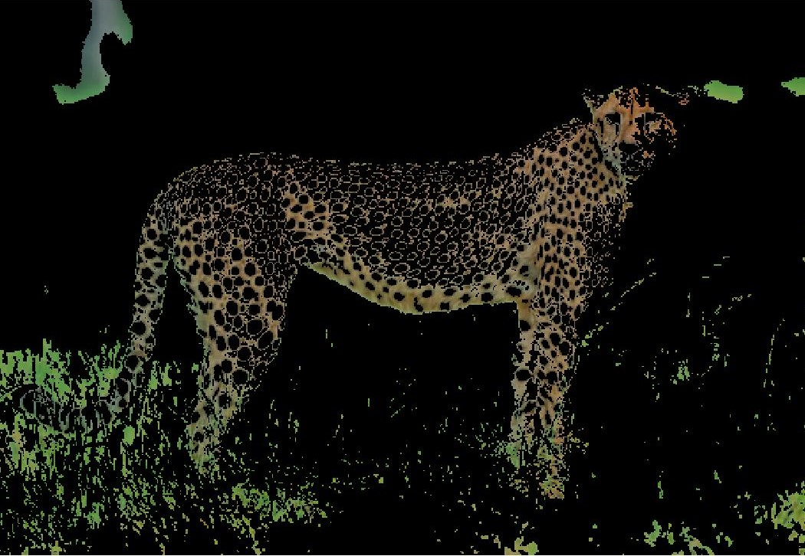
</div>

#### Chameleon
<div float="left">
   
  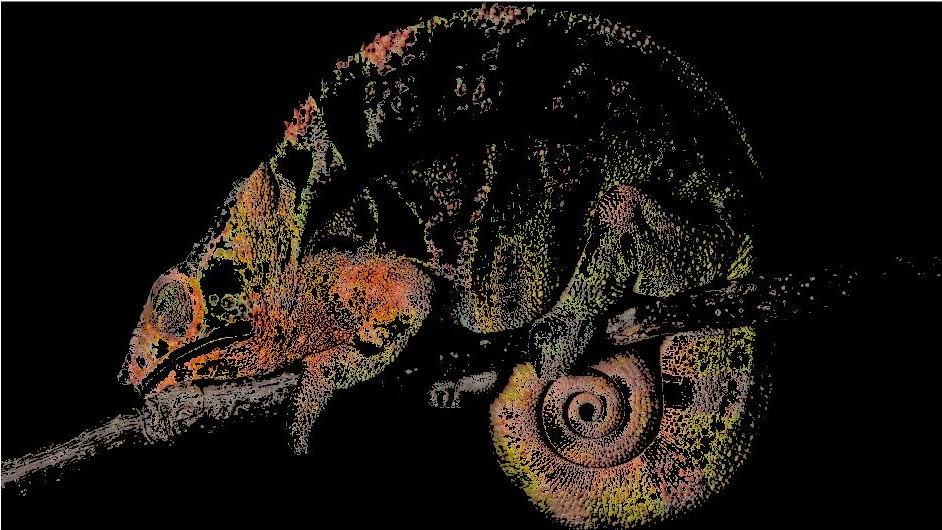
</div>
<div float="left">
  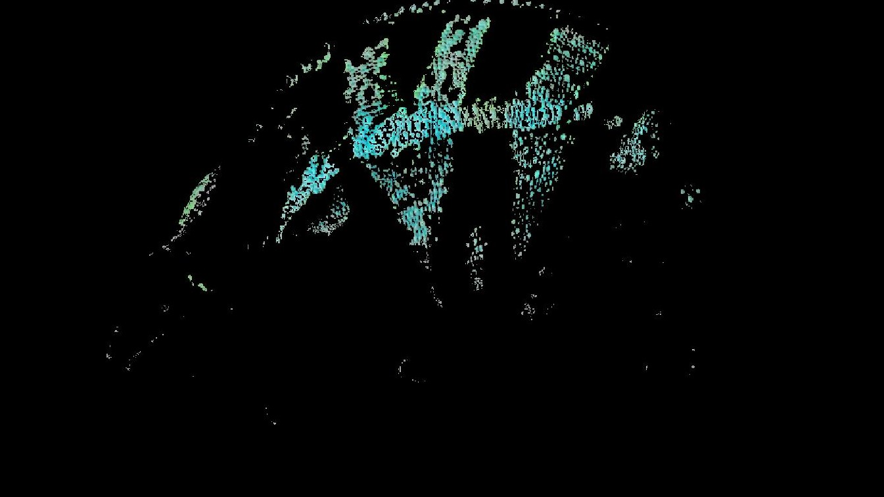 
  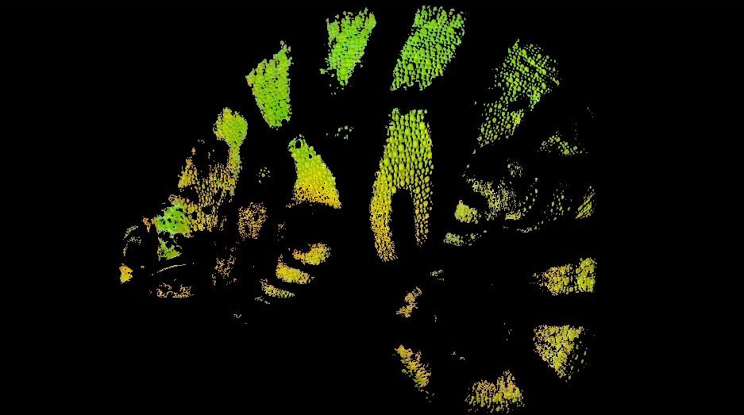
</div>


## Blurring And Restoration
<div float="left">
  
</div>

## Blurring, Addition of noise And Restoration using Weiner Filter
<div float="left">
   
</div>

## Chrominance Sub Sampling
#### YUV components
<div float="left">
  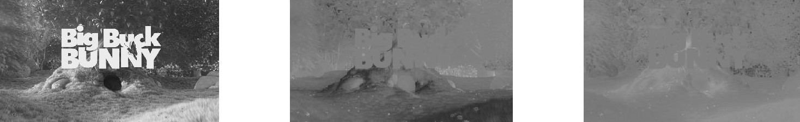 
</div>

#### U and V components after processing and the Output Image processed Image in RGB.
<div float="left">
   
</div>

## RGB colourspace components with a few modifications.
<div float="left">
   
</div>


## Filtering in frequency domain
<div float="left">
  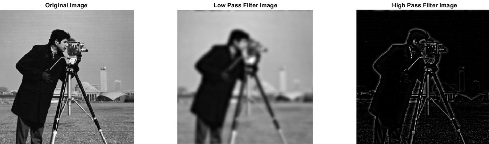
</div>

## Contrast Streching
<div float="left">
  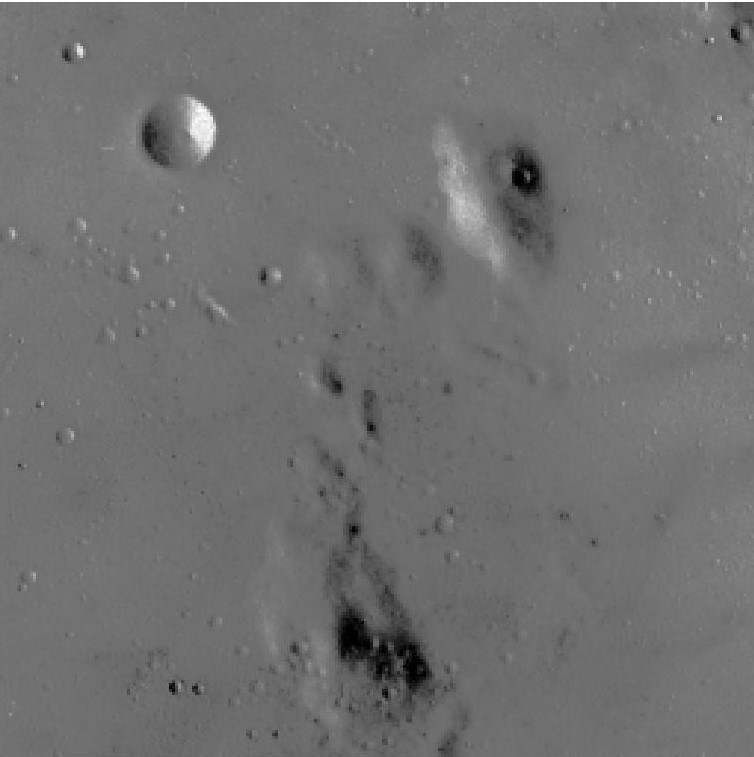 
  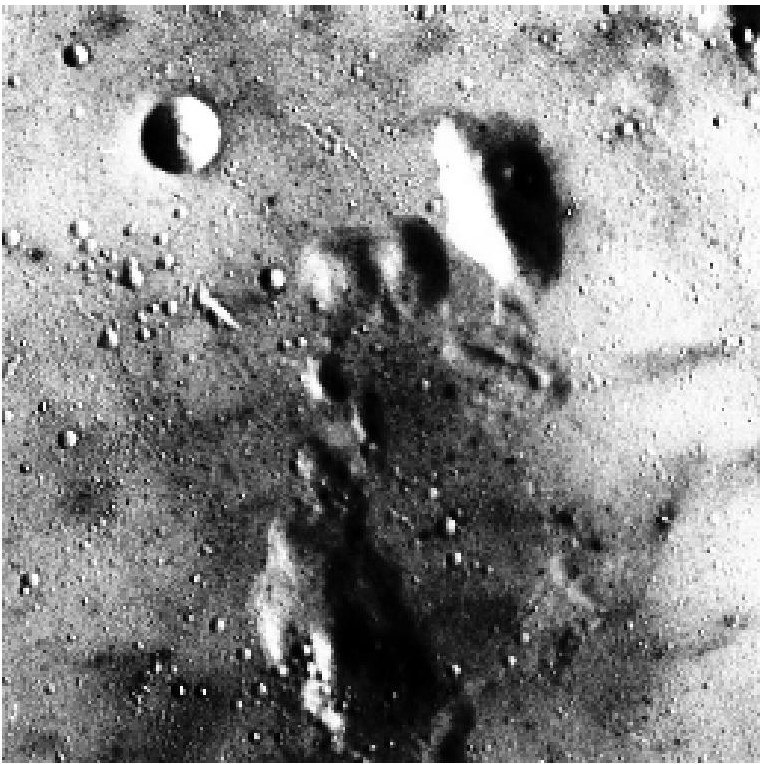
</div>
<div float="left">
  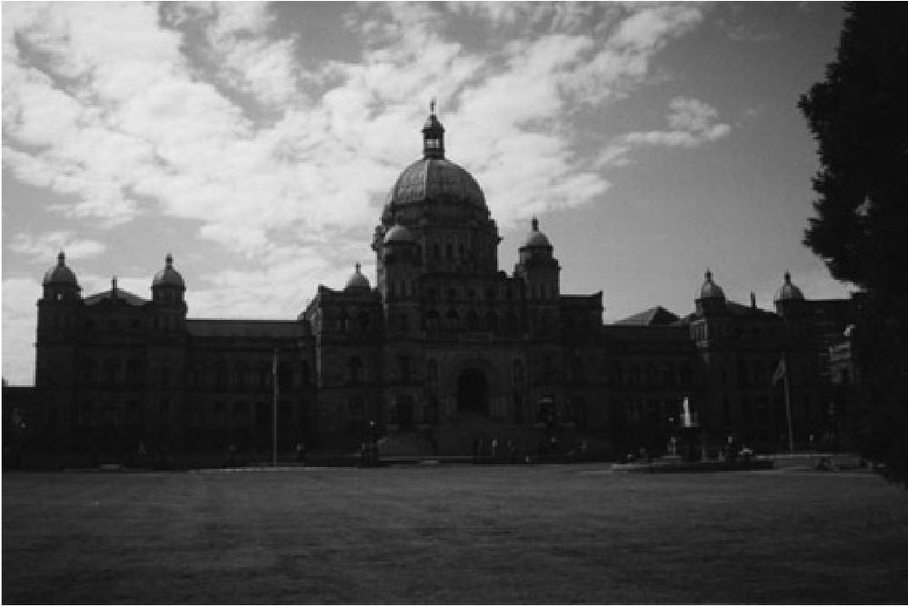 
  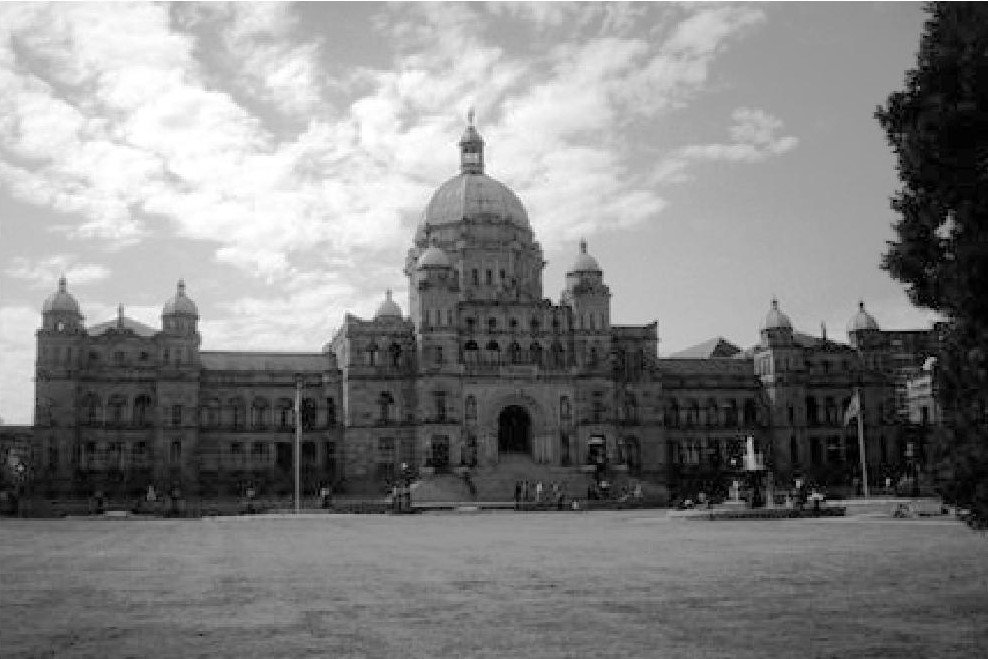
</div>

## Contrast Matching - Church image is contrast matched with respect to corel's contrast.
<div float="left">
  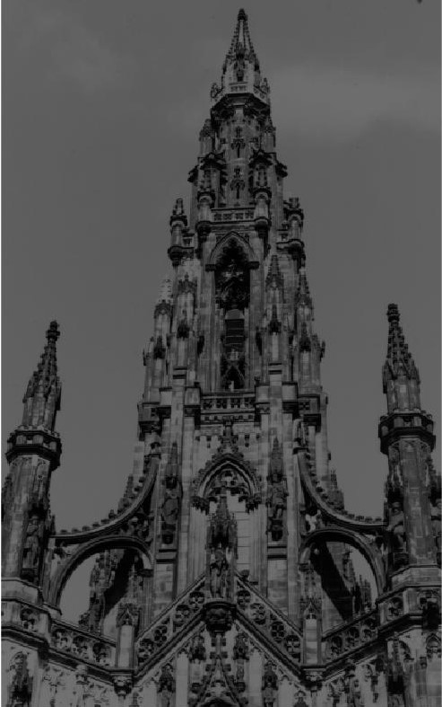 
  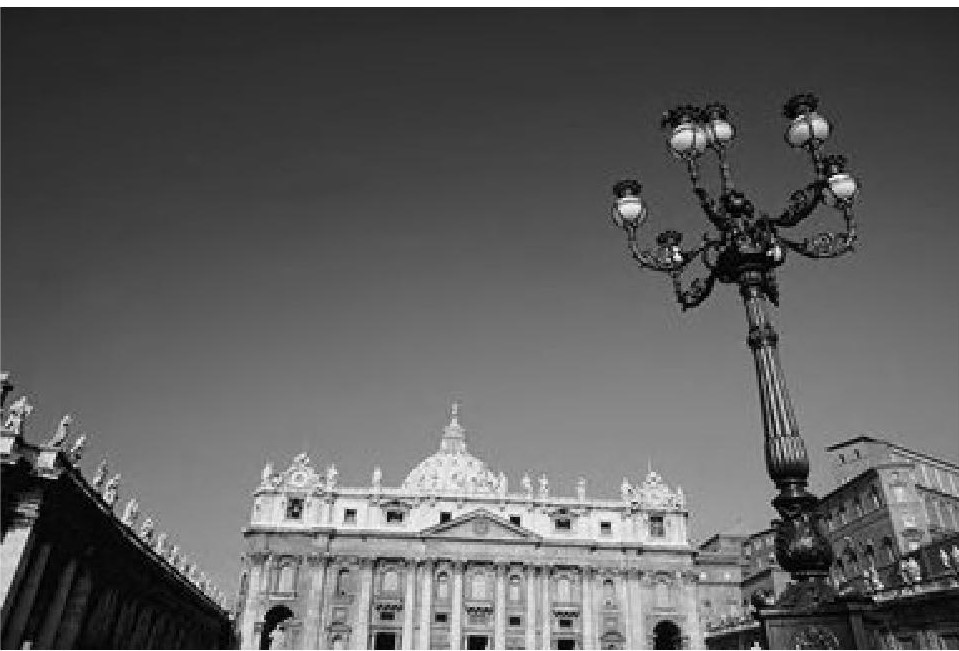
  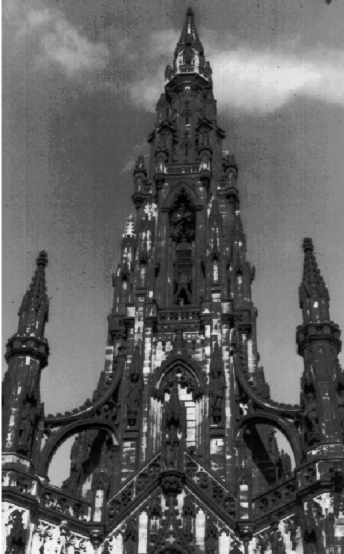
  
</div>

## Median Filtering
### Miranda1 original Image and Image with noise

<div float="left">
  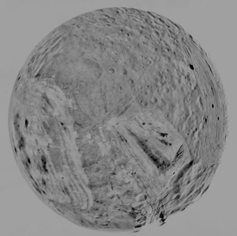 
  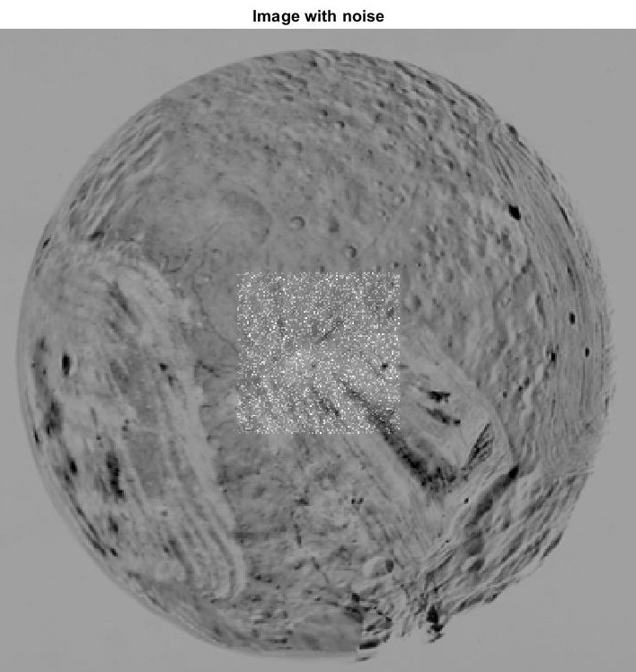
</div>

### Miranda1 image with median filters 3*3, 5*5 and 7*7
<div float="left">
  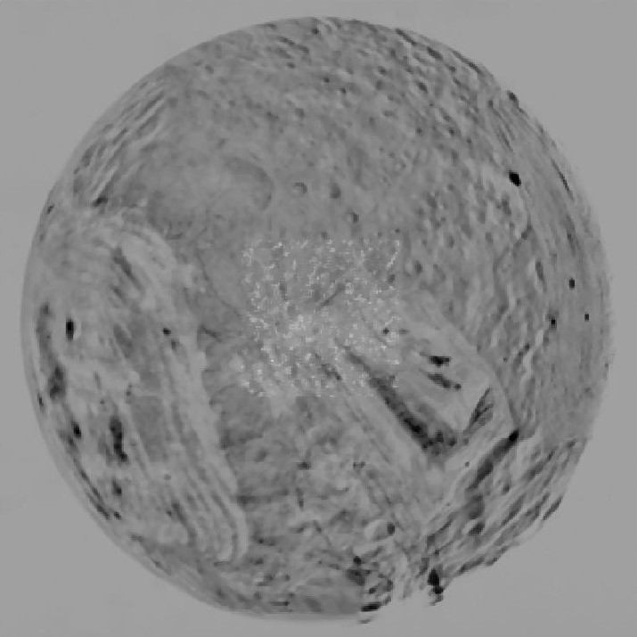 
  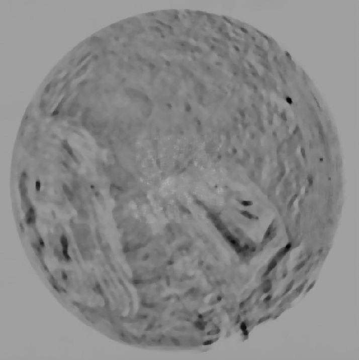
  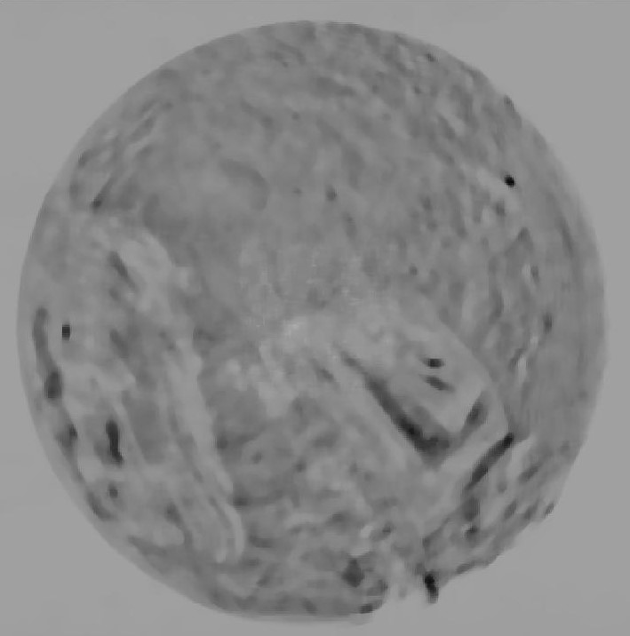
</div>

### Miranda1 image after thresholding on 3*3 kernel median filtered Image
<div float="left">
  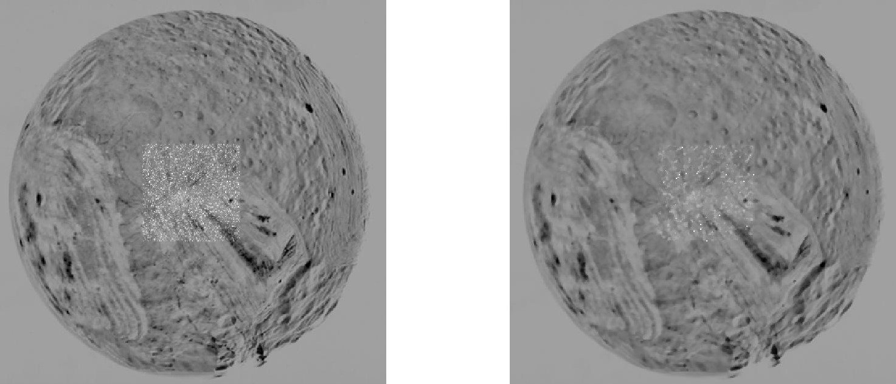 
</div>


### Miranda1 image after thresholding on 5*5 kernel median filtered Image
<div float="left">
  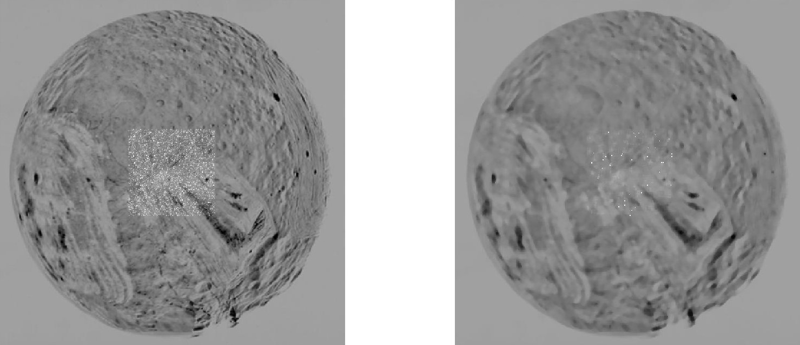 
</div>


### Miranda1 image after thresholding on 7*7 kernel median filtered Image
<div float="left">
  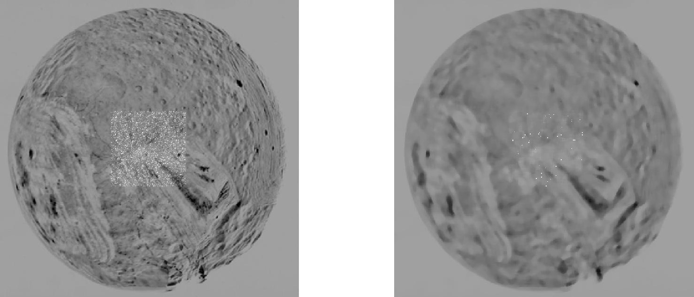 
</div>
